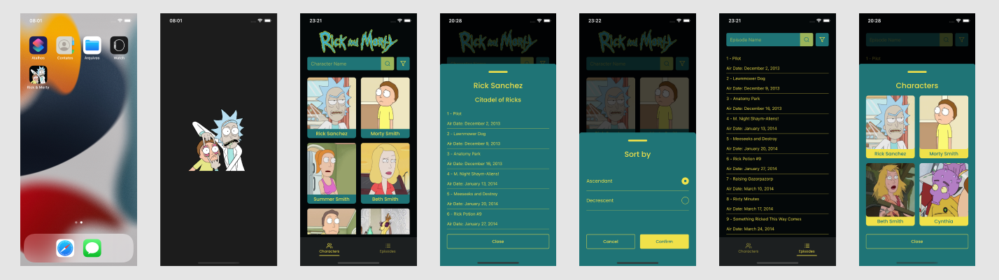

<h1 align="center">
  Rick & Morty Wiki
</h1>

<h6>
App desenvolvido em React Native, que faz a listagem de todos os personagens/episódios do desenho Rick & Morty, foi utilizada a API pública<a href="https://rickandmortyapi.com/documentation/#graphql">Rick and Morty API</a> para o consumo dos dados
</h6>

## :rocket: Como executar

<ul>
  <li>Clonar o projeto</li>
  <li>No diretório raiz, Instalar as depêndencias usando <strong>yarn</strong></li>
  <li><strong>iOS:</strong> instalar pod install, <strong>cd ios && pod install && cd ..</strong></li>
  <li>Executar comando <strong>yarn start</strong> no diretório raiz</li>
  <li>Em outro terminal, também no diretório raiz, executar <strong>yarn android</strong> ou <strong>yarn ios</strong></li>
</ul>

## :speech_balloon: Funcionalidades

<ul>
  <li>Listagem de Personagens/Episódios</li>
  <li>Busca de Personagens/Episódios por nome</li>
  <li>Tela de detalhes com informações sobre o episódio/personagem</li>
</ul>

## :iphone: Recursos Aplicados

<ul>
  <li>Navegação entre páginas</li>
  <li>Context API</li>
  <li>Criação de componentes com Styled Components</li>
  <li>Consumo de API</li>
  <li>Reac Reanimated</li>
</ul>

## ⌨️ Tecnologias

<ul>
  <li>React Native</li>
  <li>TypeScript</li>
  <li>React Navigation</li>
  <li>React Native Fast Image</li>
  <li>React Native Splash Screen</li>
  <li>React Native SVG</li>
  <li>Styled Components</li>
  <li>GraphQl</li>
  <li>Apollo</li>
</ul>
